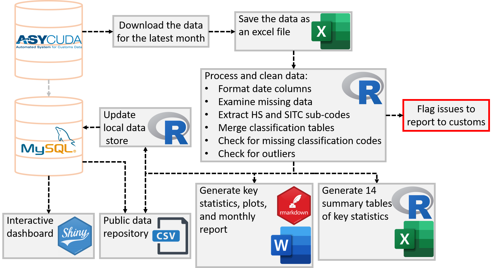

 

             

# A Reproducible Analytical Pipeline for the Vanuatu National Statistics Office Market Survey Statistics reporting&nbsp;

Producing official statistics for publications is a key function of many teams across Government. It’s a time consuming and meticulous process to ensure that statistics are accurate and timely. With open source software becoming more widely used, there’s now a range of tools and techniques that can be used to reduce production time, whilst maintaining and even improving the quality of the publications.  

> The Reproducible Analytical Pipeline (RAP) is an alternative production methodology for automating the bulk of steps involved in creating a statistical report. 

To know more about the Vanautu National Statistics Office. Click [Here](https://vnso.gov.vu)

The Vanuatu National Statistics Office collects, compiles and disseminates detailed market survey data. The Port Vila Central Market Survey summarises selected agricultural produces sold at the main wet market based on the Supply and Price of commodities. Data is collected on a fortnightly basis and published as a quarterly average.

> Sound and timely statistics are key to inform decisions, policies and investments that tackle issues related to food and agriculture, from hunger and malnutrition to rural poverty, from food systems productivity to the sustainable use of natural resources or to climate change.

To know more about Market Survey Statistics in Vanuatu. Click [Here](https://vnso.gov.vu/index.php/en/census-and-surveys/surveys/market-survey#current-market-survey)

## Resources list
- [Introduction to Reproducible Analytical Pipelines](https://ukgovdatascience.github.io/rap_companion/)
    * Free RAP Course [here](https://www.udemy.com/course/reproducible-analytical-pipelines/) 
    * Blog on RAP [here](https://dataingovernment.blog.gov.uk/2017/03/27/reproducible-analytical-pipeline/)
    * Video of Reproducible analysis using R [here](https://www.youtube.com/watch?v=qvPDE4ppAns) 

- [Introduction to International Merchandise Trade Statistics](https://www.oecd.org/sdd/its/international-merchandise-trade-statistics.htm)
    * Free international merchandise trade Course [here](https://www.unsdglearn.org/courses/e-learning-on-international-merchandise-trade-statistics/) 
    * United Nations Trade Statistics [here](https://unstats.un.org/unsd/trade/default.asp)
    * Video by the World Trade Organisation using R [here](https://www.youtube.com/watch?v=kHQJkeOxAKM) 

